# ndx-ophys-devices Extension for NWB

This is an NWB extension for storing metadata of devices used in optical experimental setup (microscopy, fiber photometry, optogenetic stimulation etc.)

## Installation


## Usage

```python

```

---
This extension was created using [ndx-template](https://github.com/nwb-extensions/ndx-template).

## Entity relationship diagram

```mermaid
%%{init: {'theme': 'base', 'themeVariables': {'primaryColor': '#ffffff', "primaryBorderColor': '#144E73', 'lineColor': '#D96F32'}}}%%
classDiagram
    direction BT
    class DeviceModel{
        <<Device>>
        --------------------------------------
        attributes
        --------------------------------------
        model : text, optional
    }
    class Indicator{
        <<Device>>
        --------------------------------------
        attributes
        --------------------------------------
        label : text
        injection_location : text, optional
        injection_coordinates_in_mm : numeric, length 3, optional
    }
    class Effector{
        <<Device>>
        --------------------------------------
        attributes
        --------------------------------------
        label : text
        injection_location : text, optional
        injection_coordinates_in_mm : numeric, length 3, optional
    }
    class OpticalFiber{
        <<DeviceModel>>
        --------------------------------------
        attributes
        --------------------------------------
        numerical_aperture : numeric, optional
        core_diameter_in_um : numeric, optional
    }
    class ExcitationSource{
        <<DeviceModel>>
        --------------------------------------
        attributes
        --------------------------------------
        illumination_type : text, optional
        excitation_wavelength_in_nm : numeric, optional
        peak_power_in_W : numeric, optional
        peak_pulse_energy_in_J : numeric, optional
        intensity_in_W_per_m2 : numeric, optional
        exposure_time_in_s : numeric, optional
        pulse_rate_in_Hz : numeric, optional
    }
    class Photodetector{
        <<DeviceModel>>
        --------------------------------------
        attributes
        --------------------------------------
        detector_type : text, optional
        detected_wavelength_in_nm : numeric, optional
        gain : numeric, optional
    }
    class DichroicMirror{
        <<DeviceModel>>
        --------------------------------------
        attributes
        --------------------------------------
        cut_on_wavelength_in_nm : numeric, optional
        cut_off_wavelength_in_nm : numeric, optional
        reflection_bandwidth_in_nm : numeric, optional
        transmission_bandwidth_in_nm : numeric, optional
        angle_of_incidence_in_degrees : numeric, optional
    }
    class OpticalFilter{
        <<DeviceModel>>
        --------------------------------------
        attributes
        --------------------------------------
        filter_type : text, optional
    }
    class BandOpticalFilter{
        <<OpticalFilter>>
        --------------------------------------
        attributes
        --------------------------------------
        center_wavelength_in_nm : numeric
        bandwidth_in_nm : numeric
    }
    class EdgeOpticalFilter{
        <<OpticalFilter>>
        --------------------------------------
        attributes
        --------------------------------------
        cut_wavelength_in_nm : numeric
        slope_in_percent_cut_wavelength : numeric, optional
        slope_starting_transmission_in_percent : numeric, optional
        slope_ending_transmission_in_percent : numeric, optional
    }
    class ObjectiveLens{
        <<DeviceModel>>
        --------------------------------------
        attributes
        --------------------------------------
        numerical_aperture : numeric, optional
        magnification : numeric, optional
    }
    class Microscope{
        <<DeviceModel>>
        --------------------------------------
        attributes
        --------------------------------------
        microscopy_type : text, optional
        doi : text, optional
    }
    OpticalFiber *-- DeviceModel : extends
    ExcitationSource *-- DeviceModel : extends
    Photodetector *-- DeviceModel : extends
    DichroicMirror *-- DeviceModel : extends
    Microscope *-- DeviceModel : extends
    ObjectiveLens *-- DeviceModel : extends
    OpticalFilter *-- DeviceModel : extends
    BandOpticalFilter *-- OpticalFilter : extends
    EdgeOpticalFilter *-- OpticalFilter : extends
```



## Contributing

Add a comment on how to contribute to this extension